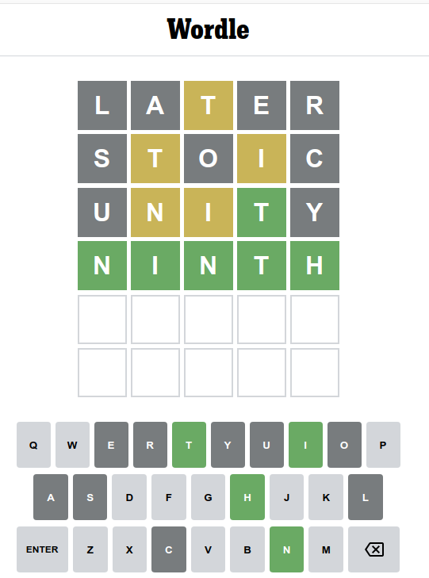
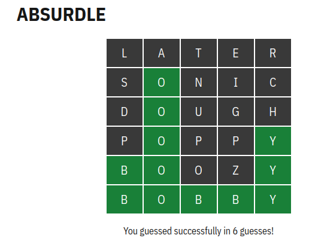

wordlesolver
Wordle and Absurdle solver

Solving Wordle - sample session
----

$ ./main.py
WORD    SCORE
LATER 1.000000
ALTER 1.000000
ALERT 1.000000
AROSE 0.991975
IRATE 0.991845
STARE 0.986534
RAISE 0.973162
$ ./main.py LAER T ..T.. .....
WORD    SCORE
STOIC 1.000000
HOIST 0.967754
POSIT 0.957803
TONIC 0.952704
SNOUT 0.942498
MOIST 0.941834
STONY 0.924885
$ ./main.py LAERSOC TI ..T..@.T.I. .....
WORD    SCORE
UNITY 1.000000
INPUT 0.969124
MINTY 0.926717
TYING 0.926184
THING 0.907875
NIGHT 0.907875
THINK 0.876608
$ ./main.py LAERSOCUY TIN ..T..@.T.I.@.NI.. ...T.
WORD  SCORE
NINTH    1.0

Solving Absurdle - sample session
----

$ ./main.py
 WORD    SCORE
LATER 1.000000
ALTER 1.000000
ALERT 1.000000
AROSE 0.991975
IRATE 0.991845
STARE 0.986534
RAISE 0.973162
$ ./main.py LATER ..... ..... .....
 WORD    SCORE
SONIC 1.000000
SCION 1.000000
NOISY 0.980652
BISON 0.926434
DISCO 0.909367
SOUND 0.846680
SYNOD 0.827478
$ ./main.py LATERSNIC O ..... .O...
 WORD    SCORE
DOUGH 1.000000
BOUGH 0.936420
HOWDY 0.917196
MOODY 0.834908
GOODY 0.834124
DODGY 0.834124
HOBBY 0.819443
$ ./main.py LATERSNICDUGH O ..... .O...
 WORD    SCORE
POPPY 1.000000
BOOZY 0.937713
BOOBY 0.935988
BOBBY 0.935988
WOOZY 0.891884
$ ./main.py LATERSNICDUGHP OY ..... .O..Y
 WORD    SCORE
BOOZY 1.000000
BOOBY 0.998161
BOBBY 0.998161
WOOZY 0.951127
$ ./main.py LATERSNICDUGHPZ OYB ..O.. BO..Y
 WORD  SCORE
BOBBY    1.0
